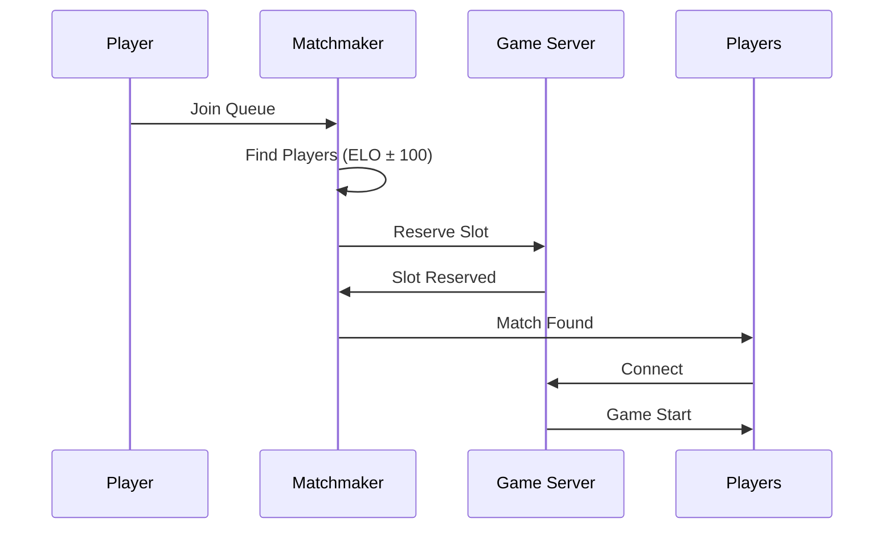

# 🏢 SURVIVOR GAME - ENTERPRISE & BACKEND PLANI
**Versiyon:** 2.0  
**Oyun:** Survivor Game (Action/Roguelike)  
**Platform:** Multi-platform (Mobile + PC)  
**Takım:** Backend, DevOps, Infrastructure

## 📋 İÇİNDEKİLER
1. [Mimari Genel Bakış](#mimari-genel-bakış)
2. [Backend Servisleri](#backend-servisleri)
3. [Veritabanı Tasarımı](#veritabanı-tasarımı)
4. [API Tasarımı](#api-tasarımı)
5. [Real-time Sistemler](#real-time-sistemler)
6. [Analytics & Monitoring](#analytics--monitoring)
7. [CI/CD Pipeline](#cicd-pipeline)
8. [Scaling Strategy](#scaling-strategy)
9. [Güvenlik & Compliance](#güvenlik--compliance)
10. [Disaster Recovery](#disaster-recovery)

## 🏗️ MİMARİ GENEL BAKIŞ

### HIGH-LEVEL ARCHITECTURE
```
┌─────────────────────────────────────────────────────────────┐
│                    CLIENT (Godot Engine)                    │
│  ┌──────────┐  ┌──────────┐  ┌──────────┐  ┌──────────┐   │
│  │ Game     │  │ UI       │  │ Audio    │  │ Network  │   │
│  │ Logic    │  │ System   │  │ System   │  │ Layer    │   │
│  └──────────┘  └──────────┘  └──────────┘  └──────────┘   │
└──────────────────────────┬──────────────────────────────────┘
                           │ HTTPS/WebSocket
┌──────────────────────────▼──────────────────────────────────┐
│                    API GATEWAY                              │
│  ┌──────────┐  ┌──────────┐  ┌──────────┐  ┌──────────┐   │
│  │ Auth     │  │ Rate     │  │ Load     │  │ SSL/TLS  │   │
│  │ Layer    │  │ Limiting │  │ Balancer │  │ Termin.  │   │
│  └──────────┘  └──────────┘  └──────────┘  └──────────┘   │
└──────────────────────────┬──────────────────────────────────┘
                           │
┌──────────────────────────▼──────────────────────────────────┐
│                    MICROSERVICES                            │
│  ┌──────────┐  ┌──────────┐  ┌──────────┐  ┌──────────┐   │
│  │ User     │  │ Game     │  │ Match-   │  │ Payment  │   │
│  │ Service  │  │ State    │  │ making   │  │ Service  │   │
│  └──────────┘  └──────────┘  └──────────┘  └──────────┘   │
│  ┌──────────┐  ┌──────────┐  ┌──────────┐  ┌──────────┐   │
│  │ Inventory│  │ Leader-  │  │ Social   │  │ Analytics│   │
│  │ Service  │  │ boards   │  │ Service  │  │ Service  │   │
│  └──────────┘  └──────────┘  └──────────┘  └──────────┘   │
└──────────────────────────┬──────────────────────────────────┘
                           │
┌──────────────────────────▼──────────────────────────────────┐
│                    DATA LAYER                               │
│  ┌──────────┐  ┌──────────┐  ┌──────────┐  ┌──────────┐   │
│  │ Postgres │  │ Redis    │  │ MongoDB  │  │ S3       │   │
│  │ (SQL)    │  │ (Cache)  │  │ (NoSQL)  │  │ (Assets) │   │
│  └──────────┘  └──────────┘  └──────────┘  └──────────┘   │
└─────────────────────────────────────────────────────────────┘
```

### TEKNOLOJİ STACK
**Backend:**
- **API Gateway:** Kong/NGINX
- **Microservices:** Node.js (Express/NestJS)
- **Real-time:** Socket.io/WebSocket
- **Message Queue:** RabbitMQ/Kafka

**Database:**
- **Primary:** PostgreSQL (relational data)
- **Cache:** Redis (session, leaderboards)
- **Analytics:** MongoDB (event tracking)
- **File Storage:** AWS S3/Cloudinary

**Infrastructure:**
- **Cloud:** AWS/GCP
- **Container:** Docker + Kubernetes
- **CI/CD:** GitHub Actions/Jenkins
- **Monitoring:** Prometheus + Grafana

## 🔧 BACKEND SERVİSLERİ

### 1. AUTHENTICATION SERVICE
**Responsibility:** User authentication and authorization

**Endpoints:**
- `POST /auth/register` - User registration
- `POST /auth/login` - User login
- `POST /auth/refresh` - Token refresh
- `POST /auth/logout` - User logout
- `POST /auth/reset-password` - Password reset

**Features:**
- JWT-based authentication
- Social login (Google, Facebook, Apple)
- 2FA support
- Session management
- Rate limiting

### 2. USER SERVICE
**Responsibility:** User profile and data management

**Endpoints:**
- `GET /users/{id}` - Get user profile
- `PUT /users/{id}` - Update user profile
- `GET /users/{id}/stats` - Get user statistics
- `GET /users/{id}/friends` - Get friend list
- `POST /users/{id}/friends` - Add friend

**Data Model:**
```sql
CREATE TABLE users (
    id UUID PRIMARY KEY,
    username VARCHAR(50) UNIQUE,
    email VARCHAR(255) UNIQUE,
    password_hash VARCHAR(255),
    created_at TIMESTAMP,
    last_login TIMESTAMP,
    level INTEGER DEFAULT 1,
    xp BIGINT DEFAULT 0,
    gems INTEGER DEFAULT 0,
    coins INTEGER DEFAULT 0,
    country_code VARCHAR(2),
    avatar_url TEXT,
    settings JSONB
);

CREATE TABLE user_sessions (
    session_id UUID PRIMARY KEY,
    user_id UUID REFERENCES users(id),
    device_info JSONB,
    created_at TIMESTAMP,
    expires_at TIMESTAMP,
    is_active BOOLEAN DEFAULT true
);
```

### 3. GAME STATE SERVICE
**Responsibility:** Save/load game state, progression

**Endpoints:**
- `GET /game-state/{userId}` - Load game state
- `POST /game-state/{userId}` - Save game state
- `GET /game-state/{userId}/backup` - List backups
- `POST /game-state/{userId}/restore` - Restore backup

**Data Model:**
```sql
CREATE TABLE game_states (
    id UUID PRIMARY KEY,
    user_id UUID REFERENCES users(id),
    character_data JSONB,
    inventory JSONB,
    progress JSONB,
    settings JSONB,
    created_at TIMESTAMP,
    updated_at TIMESTAMP,
    is_current BOOLEAN DEFAULT true
);

CREATE TABLE game_state_history (
    id UUID PRIMARY KEY,
    game_state_id UUID REFERENCES game_states(id),
    snapshot JSONB,
    created_at TIMESTAMP,
    change_type VARCHAR(50)
);
```

### 4. INVENTORY SERVICE
**Responsibility:** Item management, purchases

**Endpoints:**
- `GET /inventory/{userId}` - Get inventory
- `POST /inventory/{userId}/items` - Add item
- `DELETE /inventory/{userId}/items/{itemId}` - Remove item
- `POST /inventory/{userId}/equip` - Equip item
- `GET /inventory/{userId}/shop` - Get shop items

**Data Model:**
```sql
CREATE TABLE items (
    id UUID PRIMARY KEY,
    item_type VARCHAR(50),
    name VARCHAR(100),
    description TEXT,
    rarity VARCHAR(20),
    stats JSONB,
    price_gems INTEGER,
    price_coins INTEGER,
    unlock_level INTEGER,
    is_active BOOLEAN DEFAULT true
);

CREATE TABLE user_inventory (
    user_id UUID REFERENCES users(id),
    item_id UUID REFERENCES items(id),
    quantity INTEGER DEFAULT 1,
    acquired_at TIMESTAMP,
    is_equipped BOOLEAN DEFAULT false,
    PRIMARY KEY (user_id, item_id)
);
```

### 5. PAYMENT SERVICE
**Responsibility:** In-app purchases, payment processing

**Endpoints:**
- `POST /payments/purchase` - Process purchase
- `GET /payments/products` - Get available products
- `POST /payments/validate` - Validate receipt
- `GET /payments/history/{userId}` - Get purchase history

**Integrations:**
- Apple App Store
- Google Play Store
- Stripe (PC payments)
- PayPal

### 6. MATCHMAKING SERVICE
**Responsibility:** PvP matchmaking, room management

**Endpoints:**
- `POST /matchmaking/queue` - Join matchmaking queue
- `DELETE /matchmaking/queue` - Leave queue
- `GET /matchmaking/status` - Get queue status
- `POST /matchmaking/create-room` - Create private room

**Algorithms:**
- ELO-based matchmaking
- Skill-based matching
- Region-based matching
- Ping-based optimization

### 7. LEADERBOARD SERVICE
**Responsibility:** Rankings, competitive features

**Endpoints:**
- `GET /leaderboards/global` - Global leaderboard
- `GET /leaderboards/friends/{userId}` - Friends leaderboard
- `GET /leaderboards/season/{seasonId}` - Season leaderboard
- `POST /leaderboards/update` - Update player score

**Implementation:**
- Redis Sorted Sets for performance
- Daily/weekly/monthly leaderboards
- Season rewards
- Anti-cheat measures

### 8. SOCIAL SERVICE
**Responsibility:** Friends, clans, chat

**Endpoints:**
- `GET /social/friends/{userId}` - Get friends
- `POST /social/friends/{userId}/add` - Add friend
- `DELETE /social/friends/{userId}/remove` - Remove friend
- `GET /social/clans` - List clans
- `POST /social/clans` - Create clan
- `POST /social/chat` - Send message

**Features:**
- Real-time chat (WebSocket)
- Friend requests
- Clan management
- Social feed
- Push notifications

### 9. ANALYTICS SERVICE
**Responsibility:** Event tracking, business intelligence

**Endpoints:**
- `POST /analytics/event` - Track event
- `GET /analytics/dashboard` - Get analytics dashboard
- `GET /analytics/reports/{reportType}` - Generate reports

**Tracked Events:**
- Game session start/end
- Level completion
- Purchase events
- Ad views
- User progression
- Error events

## 🗄️ VERİTABANI TASARIMI

### POSTGRESQL SCHEMA
```sql
-- Core Tables
CREATE TABLE users (...);
CREATE TABLE user_sessions (...);
CREATE TABLE game_states (...);
CREATE TABLE items (...);
CREATE TABLE user_inventory (...);

-- Gameplay Tables
CREATE TABLE characters (
    id UUID PRIMARY KEY,
    character_class VARCHAR(50),
    base_stats JSONB,
    abilities JSONB,
    unlock_requirements JSONB
);

CREATE TABLE weapons (
    id UUID PRIMARY KEY,
    weapon_type VARCHAR(50),
    base_damage INTEGER,
    fire_rate FLOAT,
    range INTEGER,
    special_effects JSONB
);

CREATE TABLE levels (
    id UUID PRIMARY KEY,
    level_number INTEGER,
    enemy_waves JSONB,
    rewards JSONB,
    difficulty VARCHAR(20)
);

-- Social Tables
CREATE TABLE clans (
    id UUID PRIMARY KEY,
    name VARCHAR(100),
    tag VARCHAR(10),
    description TEXT,
    leader_id UUID REFERENCES users(id),
    created_at TIMESTAMP,
    member_count INTEGER DEFAULT 0
);

CREATE TABLE clan_members (
    clan_id UUID REFERENCES clans(id),
    user_id UUID REFERENCES users(id),
    role VARCHAR(20),
    joined_at TIMESTAMP,
    PRIMARY KEY (clan_id, user_id)
);

-- Economy Tables
CREATE TABLE transactions (
    id UUID PRIMARY KEY,
    user_id UUID REFERENCES users(id),
    transaction_type VARCHAR(50),
    amount DECIMAL(10,2),
    currency VARCHAR(3),
    status VARCHAR(20),
    created_at TIMESTAMP,
    metadata JSONB
);

CREATE TABLE virtual_currency (
    user_id UUID REFERENCES users(id),
    gem_balance INTEGER DEFAULT 0,
    coin_balance INTEGER DEFAULT 0,
    last_updated TIMESTAMP,
    PRIMARY KEY (user_id)
);
```

### REDIS DATA STRUCTURES
```javascript
// Leaderboards
{
  "leaderboard:global:daily": "Sorted Set",
  "leaderboard:season:1": "Sorted Set",
  "leaderboard:friends:{userId}": "Sorted Set"
}

// Caching
{
  "cache:user:{userId}:profile": "Hash",
  "cache:inventory:{userId}": "Hash",
  "cache:shop:items": "List"
}

// Session Management
{
  "session:{sessionId}": "Hash",
  "user:{userId}:sessions": "Set"
}

// Real-time Data
{
  "matchmaking:queue": "Sorted Set",
  "room:{roomId}:players": "Set",
  "chat:{channelId}:messages": "List"
}
```

## 🌐 API TASARIMI

### REST API STANDARDS
**Base URL:** `https://api.survivorgame.com/v1`

**Authentication:**
```http
Authorization: Bearer {jwt_token}
```

**Response Format:**
```json
{
  "success": true,
  "data": {},
  "error": null,
  "metadata": {
    "timestamp": "2024-01-15T10:30:00Z",
    "requestId": "req_123456"
  }
}
```

**Error Response:**
```json
{
  "success": false,
  "data": null,
  "error": {
    "code": "VALIDATION_ERROR",
    "message": "Invalid input data",
    "details": {
      "username": "Username already taken"
    }
  },
  "metadata": {
    "timestamp": "2024-01-15T10:30:00Z"
  }
}
```

### WEBSOCKET API
**Connection URL:** `wss://ws.survivorgame.com`

**Events:**
```javascript
// Client → Server
{
  "type": "JOIN_ROOM",
  "payload": {
    "roomId": "room_123",
    "userId": "user_456"
  }
}

// Server → Client
{
  "type": "PLAYER_JOINED",
  "payload": {
    "playerId": "user_789",
    "username": "Player2",
    "position": { "x": 100, "y": 200 }
  }
}
```

## ⚡ REAL-TIME SİSTEMLER

### GAME SERVER ARCHITECTURE
```
┌─────────────────────────────────────────────────────────────┐
│                    GAME SERVER CLUSTER                      │
│  ┌──────────┐  ┌──────────┐  ┌──────────┐  ┌──────────┐   │
│  │ Game     │  │ Game     │  │ Game     │  │ Game     │   │
│  │ Server   │  │ Server   │  │ Server   │  │ Server   │   │
│  │ (US-E)   │  │ (EU-W)   │  │ (AP-S)   │  │ (SA-E)   │   │
│  └──────────┘  └──────────┘  └──────────┘  └──────────┘   │
└──────────────────────────┬──────────────────────────────────┘
                           │
┌──────────────────────────▼──────────────────────────────────┐
│                    GAME STATE SYNC                          │
│  ┌──────────┐  ┌──────────┐  ┌──────────┐                  │
│  │ State    │  │ Event    │  │ Conflict │                  │
│  │ Manager  │  │ Queue    │  │ Resolver │                  │
│  └──────────┘  └──────────┘  └──────────┘                  │
└─────────────────────────────────────────────────────────────┘
```

### STATE SYNCHRONIZATION
**Approach:** Deterministic Lockstep with Rollback

**Network Protocol:**
- **Tick Rate:** 20Hz (50ms intervals)
- **Packet Size:** < 512 bytes
- **Compression:** LZ4
- **Encryption:** DTLS

**Message Types:**
1. **Input Messages** (Client → Server)
2. **State Updates** (Server → Client)
3. **Reconciliation** (Server → Client)
4. **Heartbeat** (Bidirectional)

### MATCHMAKING FLOW


## 📊 ANALYTICS & MONITORING

### EVENT TRACKING
**Event Categories:**
1. **User Events**
   - Registration
   - Login/Logout
   - Session duration
   - Retention metrics

2. **Gameplay Events**
   - Level start/complete
   - Enemy kills
   - Deaths
   - Item usage
   - Power-up collection

3. **Monetization Events**
   - Purchase attempts
   - Successful purchases
   - Ad views
   - Currency spending

4. **Technical Events**
   - Errors
   - Performance metrics
   - Device information
   - Network conditions

### MONITORING STACK
**Infrastructure Monitoring:**
- **Prometheus** - Metrics collection
- **Grafana** - Dashboards
- **AlertManager** - Alerting

**Application Monitoring:**
- **Sentry** - Error tracking
- **Datadog** - APM
- **New Relic** - Performance

**Log Management:**
- **ELK Stack** (Elasticsearch, Logstash, Kibana)
- **CloudWatch** (AWS)
- **Stackdriver** (GCP)

### KEY METRICS DASHBOARD
**Real-time Metrics:**
- Active users
- Concurrent games
- Matchmaking queue size
- API response times
- Error rates

**Business Metrics:**
- Daily/Monthly Active Users
- Retention rates
- Conversion rates
- Average Revenue Per User
- Lifetime Value

**Technical Metrics:**
- Server CPU/Memory usage
- Database query performance
- Cache hit rates
- Network latency
- Packet loss

## 🚀 CI/CD PIPELINE

### PIPELINE STAGES
```yaml
name: Production Deployment Pipeline

on:
  push:
    branches: [ main ]
  pull_request:
    branches: [ develop ]

jobs:
  test:
    runs-on: ubuntu-latest
    steps:
    - name: Checkout
      uses: actions/checkout@v3
      
    - name: Unit Tests
      run: npm test
      
    - name: Integration Tests
      run: npm run test:integration
      
    - name: E2E Tests
      run: npm run test:e2e

  build:
    needs: test
    runs-on: ubuntu-latest
    steps:
    - name: Build Docker Images
      run: |
        docker build -t user-service:${GITHUB_SHA} ./services/user
        docker build -t game-service:${GITHUB_SHA} ./services/game
        
    - name: Push to Registry
      run: |
        docker push registry.example.com/user-service:${GITHUB_SHA}
        docker push registry.example.com/game-service:${GITHUB_SHA}

  deploy-staging:
    needs: build
    runs-on: ubuntu-latest
    steps:
    - name: Deploy to Staging
      run: |
        kubectl set image deployment/user-service \
          user-service=registry.example.com/user-service:${GITHUB_SHA}
        kubectl rollout status deployment/user-service
        
  deploy-production:
    needs: deploy-staging
    if: github.ref == 'refs/heads/main'
    runs-on: ubuntu-latest
    steps:
    - name: Canary Deployment
      run: |
        # Deploy to 10% of users first
        kubectl apply -f canary-deployment.yaml
        
    - name: Monitor Canary
      run: |
        # Monitor metrics for 30 minutes
        ./scripts/monitor-canary.sh
        
    - name: Full Rollout
      run: |
        # Roll out to 100% if metrics are good
        kubectl apply -f full-deployment.yaml
```

### DEPLOYMENT STRATEGIES
1. **Blue-Green Deployment**
   - Zero downtime
   - Easy rollback
   - Traffic switching

2. **Canary Releases**
   - Gradual rollout
   - Risk mitigation
   - Performance monitoring

3. **Feature Flags**
   - Controlled feature releases
   - A/B testing
   - Emergency kill switches

## 📈 SCALING STRATEGY

### HORIZONTAL SCALING
**Stateless Services:**
- Auto-scaling based on CPU/Memory
- Load balancer distribution
- Session externalization (Redis)

**Stateful Services:**
- Sharding strategies
- Read replicas
- Connection pooling

### DATABASE SCALING
**Read Scaling:**
- Read replicas
- Connection pooling
- Query optimization

**Write Scaling:**
- Sharding by user_id
- Write-ahead logging
- Batch operations

**Cache Strategy:**
- Redis cluster
- Cache invalidation policies
- CDN for static assets

### LOAD TESTING TARGETS
| Metric | Target | Measurement |
|--------|--------|-------------|
| Concurrent Users | 100,000 | Load testing |
| Requests/Second | 10,000 | API gateway |
| Game Sessions | 20,000 | Game servers |
| Database Queries | 5,000/sec | PostgreSQL |
| Cache Operations | 50,000/sec | Redis |

## 🔒 GÜVENLİK & COMPLIANCE

### SECURITY MEASURES
1. **Network Security**
   - DDoS protection (Cloudflare)
   - WAF (Web Application Firewall)
   - VPN for internal services
   - SSL/TLS everywhere

2. **Application Security**
   - Input validation
   - SQL injection prevention
   - XSS protection
   - CSRF tokens

3. **Data Security**
   - Encryption at rest (AES-256)
   - Encryption in transit (TLS 1.3)
   - Key management (AWS KMS/HashiCorp Vault)
   - Data masking

### COMPLIANCE REQUIREMENTS
1. **GDPR** (EU Data Protection)
   - Data portability
   - Right to be forgotten
   - Privacy by design

2. **CCPA** (California Consumer Privacy)
   - Opt-out of data sale
   - Data access requests
   - Privacy notices

3. **COPPA** (Children's Online Privacy)
   - Parental consent
   - Age verification
   - Limited data collection

4. **PCI DSS** (Payment Card Industry)
   - Secure payment processing
   - Regular security audits
   - Data encryption

### SECURITY AUDITING
**Automated Scanning:**
- Daily vulnerability scans
- Dependency checking
- Code analysis

**Manual Testing:**
- Penetration testing (quarterly)
- Security code reviews
- Threat modeling

**Incident Response:**
- 24/7 monitoring
- Escalation procedures
- Post-mortem analysis

## 🚨 DISASTER RECOVERY

### BACKUP STRATEGY
**Database Backups:**
- **Frequency:** Hourly incremental, Daily full
- **Retention:** 30 days
- **Storage:** Multiple regions
- **Encryption:** AES-256

**Game State Backups:**
- **Real-time replication**
- **Point-in-time recovery**
- **Cross-region redundancy**

### RECOVERY OBJECTIVES
**RTO (Recovery Time Objective):**
- Critical services: < 15 minutes
- Non-critical: < 2 hours

**RPO (Recovery Point Objective):**
- User data: < 5 minutes
- Game state: < 1 minute
- Analytics: < 1 hour

### DISASTER SCENARIOS
1. **Region Outage**
   - Traffic rerouting
   - Database failover
   - Cache replication

2. **Database Corruption**
   - Point-in-time recovery
   - Data validation
   - Integrity checks

3. **DDoS Attack**
   - Traffic filtering
   - Rate limiting
   - CDN protection

4. **Data Breach**
   - Incident response
   - User notification
   - Forensic analysis

## 📋 IMPLEMENTATION TIMELINE

### PHASE 1: FOUNDATION (Hafta 1-4)
- Basic authentication service
- User profile management
- Simple game state saving
- Basic monitoring

### PHASE 2: CORE FEATURES (Hafta 5-8)
- Inventory system
- Payment integration
- Matchmaking service
- Analytics pipeline

### PHASE 3: SCALING (Hafta 9-12)
- Microservices architecture
- Database sharding
- Cache implementation
- Load balancing

### PHASE 4: ADVANCED FEATURES (Hafta 13-16)
- Real-time game servers
- Social features
- Advanced analytics
- AI/ML integration

## 📊 BÜTÇE & KAYNAK PLANLAMASI

### INFRASTRUCTURE COSTS
| Service | Monthly Cost | Notes |
|---------|--------------|-------|
| AWS/GCP | $2,000 - $5,000 | Scaling with users |
| CDN | $500 - $1,000 | Asset delivery |
| Database | $1,000 - $3,000 | Managed services |
| Monitoring | $500 - $1,000 | Tools and alerts |
| **Total** | **$4,000 - $10,000** | 10k-50k DAU |

### TEAM RESOURCES
| Role | Count | Responsibilities |
|------|-------|------------------|
| Backend Developer | 2-3 | Microservices, APIs |
| DevOps Engineer | 1-2 | Infrastructure, CI/CD |
| Database Admin | 1 | Performance, scaling |
- Security Engineer | 0.5 | Audits, compliance |

### TIMELINE & MILESTONES
| Milestone | Timeline | Success Criteria |
|-----------|----------|------------------|
| MVP Launch | Month 3 | 1,000 DAU |
| Feature Complete | Month 6 | 10,000 DAU |
| Scaling Ready | Month 9 | 50,000 DAU |
| Enterprise Grade | Month 12 | 100,000 DAU |

---
**Plan Sahibi:** Backend/DevOps Team  
**Onay:** [ ] CTO  
**Onay:** [ ] Head of Engineering  
**Sonraki Review:** Quarterly